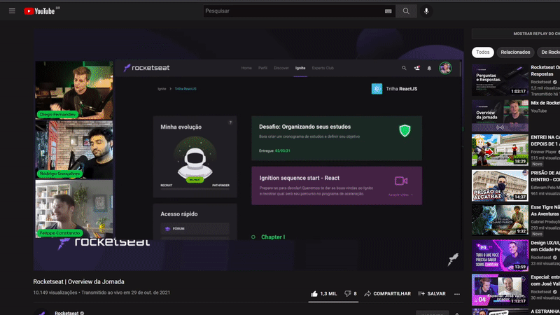

#
### Video Preview na Web com vídeos do Youtube.

#

### O que é um Video Preview?
<p>Video Preview é a pré visualização do conteúdo, nesse caso um vídeo do Youtube. A pré visualização te possibilita visulizar um trecho do vídeo antes de abrir o vídeo em si. Você talvez já tenha visto diversas vezes este sistema em ação, um exemplo de Video Preview é no próprio Youtube, mas existe outras plataformas que utilizam. Sendo elas:</p>

<ul>
    <li>Netflix</li>
    <li>Tiktok</li>
</ul>

<p>Nesse projeto foi utilizados vídeos do próprio Youtube, e para isso foi preciso utilizar o famoso iframe.</p>

#

### Mas afinal, o que é esse tal de iframe?
<p>Trata-se de uma tag HTML que, ao ser utilizada em uma página, permite a inserção de outra página nesse elemento. Ele é utilizado para inserir em um quadro uma série de objetos, como vídeos, banners, visualizações de arquivos e muito mais. Saiba mais como utilizar em: <a href="https://www.w3schools.com/html/html_iframe.asp">w3schools</a></p>

<br />

### Como será utilizado o iframe nesse projeto?
<p>Nesse projeto, como foi dito, iremos utilizar vídeos do Youtube, e sorte a nossa que o Youtube tem seu próprio gerador de iframe com já quase tudo configurado. Para utilizar essa ferramenta do Youtube é bem simples... </p>



<br />
<br />

<p>O mais importante do iframe nesse projeto é o src, que passa o link do vídeo. Além do link é possível passar parâmetros, e é ai que está a grande jogada.</p>

``` HTML
<iframe 
src="https://www.youtube.com/embed/${VIDEO_ID}"
title="YouTube video player" 
frameborder="0"
allow="autoplay;">
</iframe> 
```

<p>Nesse projeto os seguidores parâmetros foram utilizados na url:</p>

- ``controls=0`` - Remover os controles do vídeo;
- ``disablekb=1`` - Desativar a interação com vídeo pelo o teclado;
- ``fs=0`` - Remover o botão de tela cheia;
- ``rel=0`` - Desativar a exibição de vídeos relacionados quando a reprodução do vídeo inicial acabar;
- ``start=${value}`` - Este parâmetro faz com que o vídeo comece a reproduzir em um tempo determinado.
- ``autoplay=0`` - O parâmetro mais importante do projeto, com sua ação de iniciar o vídeo automaticamente. (Esse parâmetro não será exibido na url inicialmente)

``` html
<iframe src="https://www.youtube.com/embed/${VIDEO_ID}?controls=0&disablekb=1&fs=0&rel=0&start=0"></iframe>
```

<a href="https://developers.google.com/youtube/player_parameters?hl=pt-br#disablekb">Veja mais parâmetros do iframe do Youtube</a>

#


## Como desenvolver:

<p>Adicionar o iframe ao HTML. (Não utilizado no projeto do Repositório);</p>

``` HTML
<iframe 
src="https://www.youtube.com/embed/${VIDEO_ID}?controls=0&disablekb=1&fs=0&rel=0&start=0"
title="YouTube video player" 
frameborder="0"
allow="autoplay;">
</iframe> 
<!-- O mais importante e o único que iremos utilizar é o SRC, mas não descarte os outros. -->
```

<p>No Javascript a primeira coisa que iremos fazer é chamar elemento "iframe".</p>

```JS
let iframeElement = document.querySelector('iframe')
```

<p>É importante criar uma variável para salvar o estado inicial da url do iframe.</p>

```JS
let saveValueIframe = iframeElement.src
```

<p>Nesse Preview o vídeo será reproduzido por 30 segundos, então vamos criar uma variável para "setTimeout()".</p>

```JS
let timer30s; // Por enquanto vazia mesmo.
```


<p>A ideia de um Preview é quando passar o mouse sobre o vídeo o mesmo iniciar. Então para isso será utilizado o evento "mouseenter", para quando o mouse entrar na box do vídeo. <a href="https://developer.mozilla.org/pt-BR/docs/Web/Events" target="_blank">Veja mas eventos</a></p> 


```JS
iframeElement.addEventListener('mouseenter', () => {
    ...
})
```

<p>Então, quando o usuário entrar com o mouse na box do vídeo, será verificado se não existe nada no index "5" da url, se não existir será adiconado o parâmetro: "&autoplay=1"...</p>

```JS
if (!iframeElement.src.split('&')[5]) {...}
```
<p>O motivo do index 5 é pelo simples fato dele ser o quinto parâmetro na url. 
Depois de verificar e retornar que não existe o parâmetro, vamos fazer a adição do mesmo.</p>

```JS
iframeElement.src = iframeElement.src + '&autoplay=1'
```
<p>Depois de adicionado e já podendo iniciar o vídeo com o passar do mouse, precisamos dizer que enquanto o mouse estiver dentro da box do vídeo, o vídeo rode por 30s. Para isso iremos pegar aquela variável criada lá no início. Lembra dela? Ótimo! Ela será utilizada para adicionar um "setTimeout()" de 30s... </p>

```JS
if (!iframeElement.src.split('&')[5]) {
    iframeElement.src = iframeElement.src + '&autoplay=1'

    timer30s = setTimeout(() => {
    ...
    }, 30000)
}   
```

<p>Quando acabar os longos 30s, vamos remover o "&autoplay=1" da url pra parar o vídeo. Para mim, a forma mais fácil de fazer isso é reescrevendo o src com aquela variável criada para salvar o estado inicial do "iframeElement.src". Então para isso...</p>

```JS
iframeElement.src = saveValueIframe
```

<p>Certo! Está tudo perfeito, mas como parar o vídeo? Simples! Vamos adicionar um evento chamado de: "mouseleave", que será chamado quando o mouse sair da box do vídeo.</p>

```JS
iframeElement.addEventListener('mouseleave', () => {
    ...
})
```

<p>Perfeito! Agora vamos retornar a url para o estado inicial e remover o setTimeout(). Para isso...</p>

```JS
iframeElement.src = saveValueIframe
clearTimeout(timer30s)
```

<br />

### Exemplo Final - JS
```JS
let iframeElement = document.querySelector('iframe')
let saveValueIframe = iframeElement.src
let timer30s; // Por enquanto vazia mesmo.

iframeElement.addEventListener('mouseenter', () => {
    if (!iframeElement.src.split('&')[5]) {
        iframeElement.src = iframeElement.src + '&autoplay=1'

        timer30s = setTimeout(() => {
            iframeElement.src = saveValueIframe
        }, 30000)
    }   
})

iframeElement.addEventListener('mouseleave', () => {
    iframeElement.src = saveValueIframe
    clearTimeout(timer30s)
})

```

<p>Tudo perfeito! Chegamos ao final do código. Esse é um simples exemplo de como desenvolver o Video Preview e este exemplo não é 100% do que foi feito no projeto oficial.</p>

<br />

### Teste você mesmo...
<a href="https://codepen.io/ucarlos1001/pen/vYJpmRL" target="_blank">Exemplo no Codepen</a>